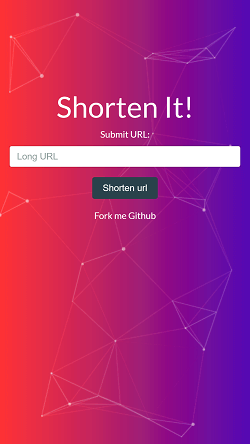
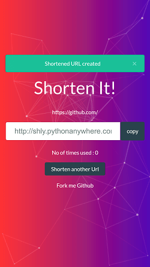
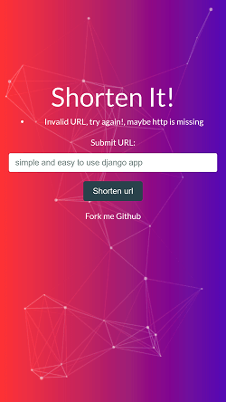
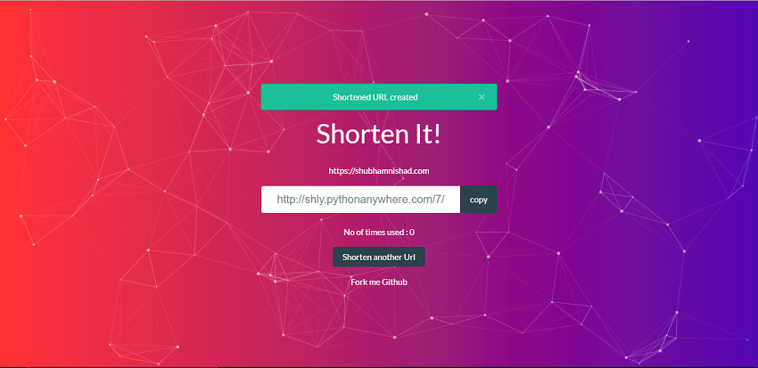

# URL-Shortener [](https://travis-ci.org/shubhamnishad97/URL-Shortener)
A simple and easy to use web app built using Django. Simply give the url you want reduced and get the new shortened url based on
base62 encoding.

Wanna try this app? Visit: http://shly.pythonanywhere.com/

I developed this app after watching this [video](https://www.youtube.com/watch?v=fMZMm_0ZhK4) by Tushar Roy about tiny url.
I wanted my own solution and was also interested in particle.js hence this project was born.

## Features:

*   Url shortening using [Base62](https://www.kerstner.at/2012/07/shortening-strings-using-base-62-encoding/) encoding.  (a-zA-Z0-9)
*   REST API for retrieving data easily.
*   Beautiful background using [particles.js](http://vincentgarreau.com/particles.js/)
*   Fully responsive. use any device and always find the best layout.


            
 


## Working

Each url has a unique id in the database. We use this id and encode it using [Base62](https://www.kerstner.at/2012/07/shortening-strings-using-base-62-encoding/) encoding. This encoded string is stored as the short url for the original url.

```python
def b62_encode(number):
    base = string.digits+string.ascii_letters
    assert number >= 0, 'positive integer required'
    if number == 0:
        return '0'
    base62 = []
    while number != 0:
        number, i = divmod(number, 62)
        base62.append(base[i])
    return ''.join(reversed(base62))
```

## How to run the project locally
Download the [zip](https://github.com/shubhamnishad97/URL-Shortener/archive/master.zip) or Clone this repository:
`git clone https://github.com/shubhamnishad97/URL-Shortener.git`

Install the dependencies by simply executing:
`pip install -r requirements.txt`

Run this command to start the app:
`python manage.py runserver`

Visit `127.0.0.1:8000` on your web browser and don't forget to give me some feedback.

## Todo

- making a REST api for this project.
- suggestions are welcome


## License [MIT](https://github.com/shubhamnishad97/URL-Shortener/blob/master/LICENSE)
